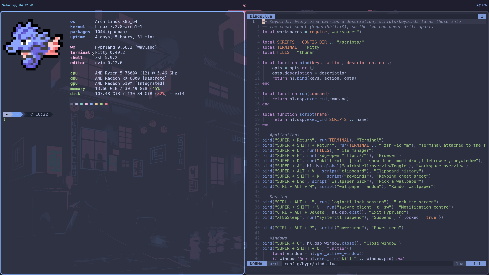
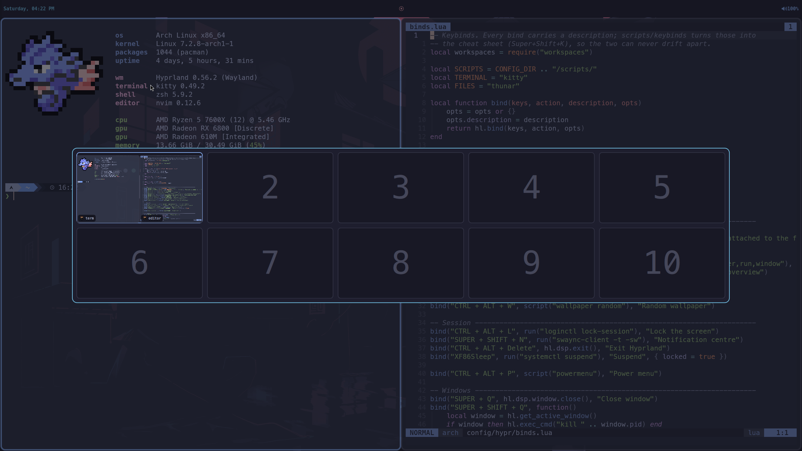
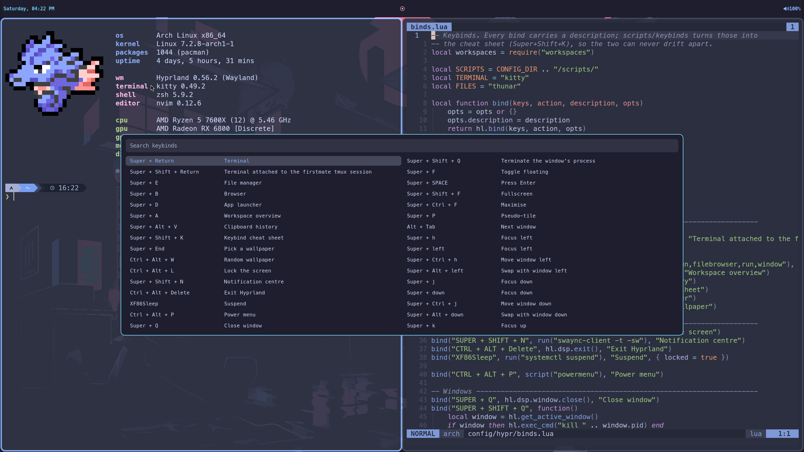
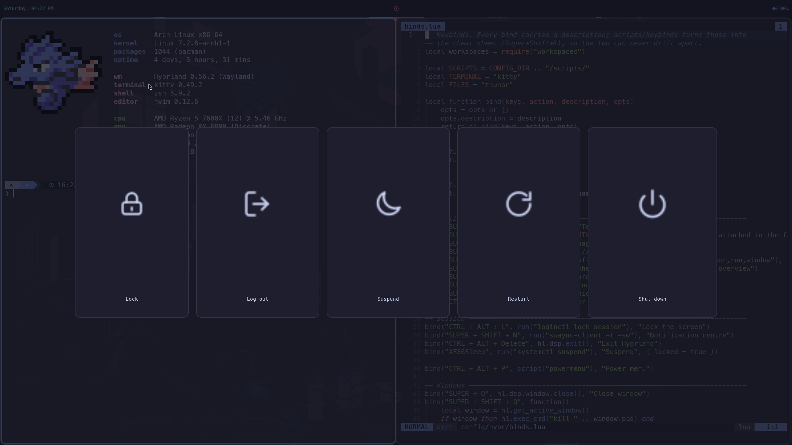

# dotfiles

My Arch Linux and Hyprland setup: the desktop, the shell, the editor, and the
way I run Claude Code. It is a working machine's config, written by hand and
published so it can be read and borrowed from.



| Workspace overview (`Super+A`) | Keybind cheat sheet (`Super+Shift+K`) | Power menu |
|---|---|---|
|  |  |  |

The screenshots are taken on an off-screen copy of the desktop; [docs/screenshots](docs/screenshots/README.md) explains how.

## What is worth a look

- **Every piece written by hand.** The launcher, notification centre, power
  menu, terminal theme and workspace overview are all original and share one
  palette, so the desktop reads as one design. The overview is a single QML
  file: [config/quickshell/shell.qml](config/quickshell/shell.qml).
- **Hyprland configured in Lua.** No generated config and no
  wallpaper-driven recolouring: one fixed palette, per-monitor workspace logic
  inside the compositor instead of in shell scripts, and every keybind carrying
  a description that the on-screen cheat sheet and [docs/keybinds.md](docs/keybinds.md)
  are both built from. Start at [config/hypr/README.md](config/hypr/README.md).
- **A shell that is fast for agents and comfortable for people.** zsh is split
  three ways so automation gets a 1 ms shell with plain coreutils while
  interactive sessions keep the full setup. [docs/shell.md](docs/shell.md)
  explains the split and lists the aliases.
- **Claude Code as part of the machine.** A status line, permission rules,
  hooks, and an [AGENTS.md](AGENTS.md) that tells agents which decisions here
  are deliberate. See [claude/](claude/).
- **Local push-to-talk dictation** on `Super+V`. The binds live here; the
  speech pipeline is its own project.
- **Checked on every push.** Shell scripts are linted, the shell helpers and the
  installer have tests, the history is scanned for secrets, and Hyprland itself
  validates the config. See [.github/workflows/check.yml](.github/workflows/check.yml).

## Layout

```
bash/        bashrc, bash_profile
claude/      Claude Code status line, example settings, global CLAUDE.md
config/      ~/.config subtrees (Hyprland, waybar, kitty, nvim, etc.), plus sddm/Xsetup
docs/        keybinds, shell, machine setup, OpenRGB
git/         gitconfig, global ignore
gtk/         gtkrc-2.0 (GTK2; GTK3/4 live under config/)
keyd/        keyd remap config (symlinked to /etc/keyd/)
openrgb/     RGB profile, restore hook, systemd drop-ins (all symlinked out)
shell/       dircolors
starship/    starship.toml (prompt)
systemd/     user timers (hub-watch, docker-prune) and the hub-watch script
tests/       tests for the installer
tmux/        tmux.conf (crew session for firstmate, Catppuccin Frappe to match kitty)
zsh/         zshenv (env + PATH), zshrc (interactive only), functions.zsh (portable helpers)
```

## Setup

Clone the repo and create symlinks:

```bash
git clone https://github.com/JoshuaHayesWasHere/dotfiles.git ~/dotfiles
cd ~/dotfiles && git checkout arch

# Shell + git
mkdir -p ~/.config/git
ln -sf ~/dotfiles/zsh/zshenv         ~/.zshenv
ln -sf ~/dotfiles/zsh/zshrc          ~/.zshrc
ln -sf ~/dotfiles/bash/bashrc        ~/.bashrc
ln -sf ~/dotfiles/bash/bash_profile  ~/.bash_profile
ln -sf ~/dotfiles/git/config         ~/.config/git/config
ln -sf ~/dotfiles/git/ignore         ~/.config/git/ignore
ln -sf ~/dotfiles/shell/dircolors    ~/.dircolors
ln -sf ~/dotfiles/gtk/gtkrc-2.0      ~/.gtkrc-2.0

# Starship prompt
mkdir -p ~/.config
ln -sf ~/dotfiles/starship/starship.toml ~/.config/starship.toml

# tmux
mkdir -p ~/.config/tmux
ln -sf ~/dotfiles/tmux/tmux.conf ~/.config/tmux/tmux.conf

# systemd user units: hub watcher, weekly Docker prune, ssh-agent
mkdir -p ~/.config/systemd/user
for u in ~/dotfiles/systemd/user/*; do ln -sfn "$u" ~/.config/systemd/user/; done
systemctl --user daemon-reload
systemctl --user enable --now hub-watch.timer hub-watch-deep.timer docker-prune.timer ssh-agent.socket

# Claude Code
mkdir -p ~/.claude
cp -n ~/dotfiles/claude/settings.example.json ~/dotfiles/claude/settings.json  # then make it yours; the copy is untracked
ln -sf ~/dotfiles/claude/settings.json  ~/.claude/settings.json
ln -sf ~/dotfiles/claude/statusline.sh  ~/.claude/statusline.sh
ln -sf ~/dotfiles/claude/CLAUDE.md      ~/.claude/CLAUDE.md

# ~/.config: symlink each tracked subtree
mkdir -p ~/.config
for d in hypr waybar rofi wlogout swaync swappy kitty nvim btop cava \
         fastfetch qalculate Kvantum qt5ct qt6ct gtk-3.0 gtk-4.0 nwg-look \
         nwg-displays xsettingsd Thunar quickshell fontconfig htop; do
  ln -sfn ~/dotfiles/config/$d ~/.config/$d
done
ln -sf ~/dotfiles/config/mimeapps.list    ~/.config/mimeapps.list
ln -sf ~/dotfiles/config/user-dirs.dirs   ~/.config/user-dirs.dirs
ln -sf ~/dotfiles/config/user-dirs.locale ~/.config/user-dirs.locale
```

## More

| Page | Covers |
|------|--------|
| [docs/keybinds.md](docs/keybinds.md) | Every keybind, generated from the running compositor |
| [config/hypr/README.md](config/hypr/README.md) | How the Hyprland config is organised, and how to test a change |
| [docs/shell.md](docs/shell.md) | The zsh split, aliases and helper commands |
| [docs/machine.md](docs/machine.md) | Packages, keyboard remap, login screen, health timers, git and SSH |
| [docs/openrgb.md](docs/openrgb.md) | RGB lighting and its failure modes |

## License

[MIT](LICENSE). The colours throughout are the
[Catppuccin](https://github.com/catppuccin/catppuccin) palette, and
`config/Kvantum/catppuccin-mocha-blue` and `config/btop/themes` are that
project's own themes, unmodified, under [its MIT license](licenses/catppuccin.txt).
